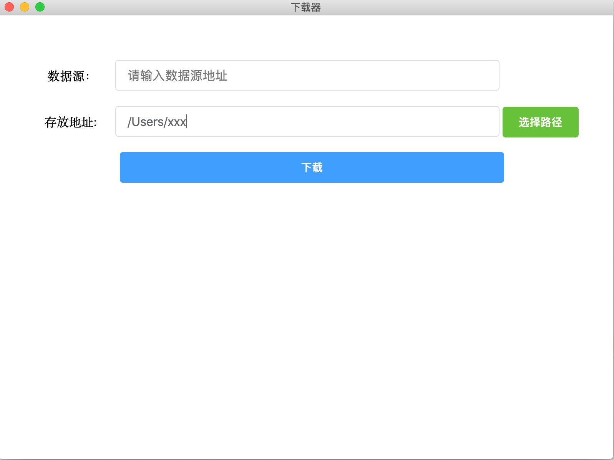

# electron-download

electron download by ffmpeg

## support

- mac
- window
- linux

## test

use nginx rtmp plugin


``` nginx
rtmp {
  server {
    listen 1935;

    application rtmplive {
        live on;
        max_connections 1024;
    }
    application hls {

        live on;
        hls on;
        hls_path /usr/local/var/www/hls;
        hls_fragment 1s;

   }

  }

}
```

push stream


```
ffmpeg -re -i [absolute dir] -vcodec copy -f flv rtmp://localhost:1935/abcs/room
```

# screenshot

</img>